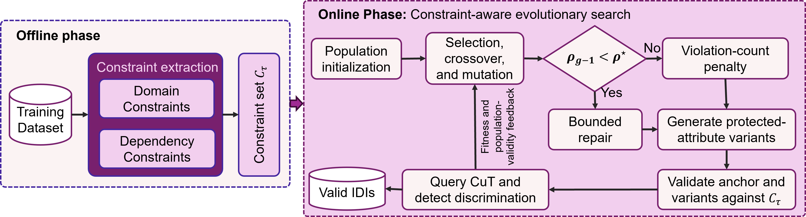

# CAFT: Constraint-Aware Fairness Testing of Machine Learning Software

CAFT is a constraint-aware fairness-testing framework for tabular machine-learning software.  It mines constraints from training data and uses them during evolutionary search to detect valid individual discriminatory instances.



## Installation

Use Python 3.8 or higher and ensure that pip package manager is installed

```bash
python -m venv .venv
# Windows PowerShell: .venv\Scripts\Activate.ps1
# macOS/Linux: source .venv/bin/activate
pip install -r requirements.txt
```

## Run CAFT

Run this from the repository root:

```bash
python -m src.caft.caft \
  --dataset_name census \
  --classifier_name lr \
  --sensitive_names age \
  --constraint_mode adaptive \
  --max_allowed_time 60
```

Available datasets are `census`, `bank`, `credit`, `compas`, and `meps`. Use `lr`, `rf`, or `dnn` for `--classifier_name`. Results are saved in `results/CAFT/` and `test_data/CAFT/`.

## Repository contents

- `src/caft/`: CAFT implementation, constraint extractor, and validator.
- `src/baselines/`: baseline fairness-testing tools.
- `datasets/` and `models/`: encoded datasets and trained classifiers.
- `test_data/`: saved test artefacts.
- `scripts/`: experiment and analysis scripts.

## License

[MIT License](LICENSE)
